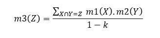
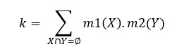

# sistem-pakar
Web untuk mengetahui tingkat depresi seseorang menggunakan Metode Certainty Factor dan  Metode Dempster Shafer

#### Metode Certainty Factor

Certainty Factor merupakan salah satu teknik yang digunakan untuk mengatasi ketidakpastian dalam pengambilan keputusan. Certainty Theory menggunakan suatu nilai untuk mengasumsikan derajat keyakinan seorang pakar terhadap suatu data dalam mengekspresikan derajat keyakinan. Pada sistem pakar ini, metode Certainty Factor digunakan untuk mendapatkan nilai densitas dari tiap gejala yang dialami user. Konsep ini dituliskan dalam persamaan berikut:

CF(H,E) = MB(H,E) - MD(H,E)

dimana,

CF(H,E): Certainty Factor dari hipotesis H yang dipengaruhi oleh gejala E

MB(H,E): Nilai kenaikan kepercayaan terhadap hipotesis H yang dipengaruhi gejala E

MD(H,E): Nilai kenaikan ketidakpercayaan terhadap hipotesis H yang dipengaruhi gejala E

  
  

#### Metode Dempster Shafer

Teori Dempster Shafer merupakan suatu teori matematika sebagai pembuktian berdasarkan fungsi kepercayaan dan pemikiran yang masuk akal, digunakan untuk mengkombinasikan potongan informasi atau fakta guna menghitung suatu kemungkinan peristiwa. Pada sistem pakar ini, metode Dempster Shafer digunakan untuk perhitungan antar gejala dengan menggunakan nilai densitas yang telah didapatkan sebelumnya untuk penarikan kesimpulan. Secara umum formula kombinasi aturan Dempster Shafer adalah:

dengan,

dimana,

m1(X): nilai densitas dari gejala X

m2(Y): nilai densitas dari gejala Y

m3(Z): nilai densitas dari gejala X dan Y

Z: hasil irisan X dan Y

∅: hasil irisan kosong X dan Y
